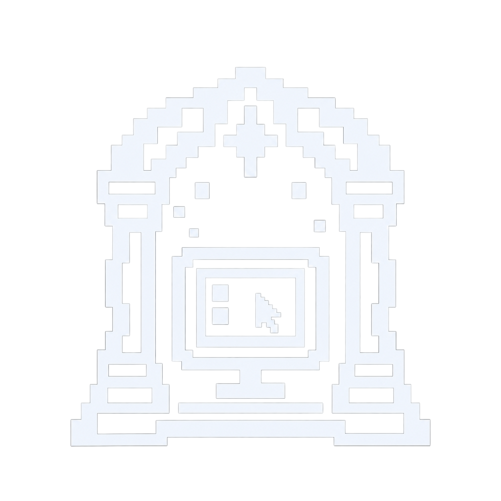

#  Portalview

Portalview helps you organize and connect to remote desktops from [Omarchy](https://omarchy.org/). Built with C++ and Qt Quick, it uses the system-installed FreeRDP 3 client for remote session windows.

## What it does

- Save, search, edit, and delete RDP connections.
- Organize connections into groups and filter the list by group.
- Double click an entry to connect, or right click to edit it.
- Prompt for passwords each session without saving them or exposing them in process arguments.
- Enable Performance mode for modem settings, reduced color depth, and fewer desktop effects.
- Keep sessions running with an optional system tray icon.
- Follow the current Omarchy theme, including live theme changes.

## Install

Download the package matching your architecture from [Releases](https://github.com/seth-reee/Portalview/releases): `x86_64` for standard Omarchy PCs or `aarch64` for ARM64.

```bash
sudo pacman -U ./portalview-0.1.1-1-x86_64.pkg.tar.zst
```

For ARM64, use the `aarch64` filename instead. Pacman installs required dependencies, including `freerdp`; FreeRDP is not bundled. Install `qt6-wayland` for native Wayland support if it is not already installed.

Both packages passed automated connection and UI tests and offscreen startup checks. **ARM64 status:** validation used Docker/QEMU; a real ARM64 Omarchy desktop and live RDP connection remain untested.

Open **Portalview** from the application menu or run `portalview`.

## Use

Choose **Add connection**, enter a name, host, port, username, and optional domain, then save. Select an existing group or type a new group name. Leave the group blank for Ungrouped. Search matches connection names, hosts, usernames, and groups.

Select a connection and choose **Connect**, or double click it. Enter the password when prompted. Remote desktops open in separate FreeRDP windows. **Disconnect** closes the selected session. Right click an entry and choose **Edit…** to change its settings.

**Performance mode** requests modem network settings and 16-bit color, and disables wallpaper, themes, font smoothing, desktop composition, full window dragging, and menu animations. Save and reconnect to apply it. The remote server may override visual settings or negotiated color depth.

Enable **System Tray Icon** to keep Portalview running when its main window closes. Right click the tray icon for **Open Main Menu**, connections grouped by name, and **Close** to quit and disconnect sessions. The tray setting persists across launches. Without an available tray, closing the window exits normally.

Connections are stored in `~/.local/share/Portalview/Portalview/connections.json` by default, respecting `XDG_DATA_HOME`. Saves are atomic. Passwords are used only for the current session. Certificates must be trusted by default; the per-connection trust-on-first-use option remembers the initial certificate using FreeRDP's certificate store and rejects changes.

## Build

Dependencies: `qt6-base`, `qt6-declarative`, `freerdp`, `cmake`, `ninja`, and a C++20 compiler. Install `qt6-wayland` for native Wayland support.

```bash
cmake -S . -B build -G Ninja
cmake --build build
ctest --test-dir build --output-on-failure
./build/portalview
```

To build the Arch package on either architecture, install `base-devel`, `cmake`, and `ninja`, then run `makepkg -s` from `packaging/`. The recipe downloads the source archive for the matching release and verifies its pinned SHA256. See [AGENTS.md](AGENTS.md) for the cached Docker/QEMU ARM build workflow.

For a manual installation:

```bash
cmake --install build --prefix "$HOME/.local"
```

Theme colors load from `$XDG_STATE_HOME/omarchy/current/theme/colors.toml` (default `~/.local/state`) and refresh within two seconds. A fallback palette supports other desktops. Gateway connections, a credential vault, file sharing, and connection import are not implemented yet.

## License

Portalview is made by [seth-reee](https://github.com/seth-reee) and is available under the [MIT License](LICENSE).
